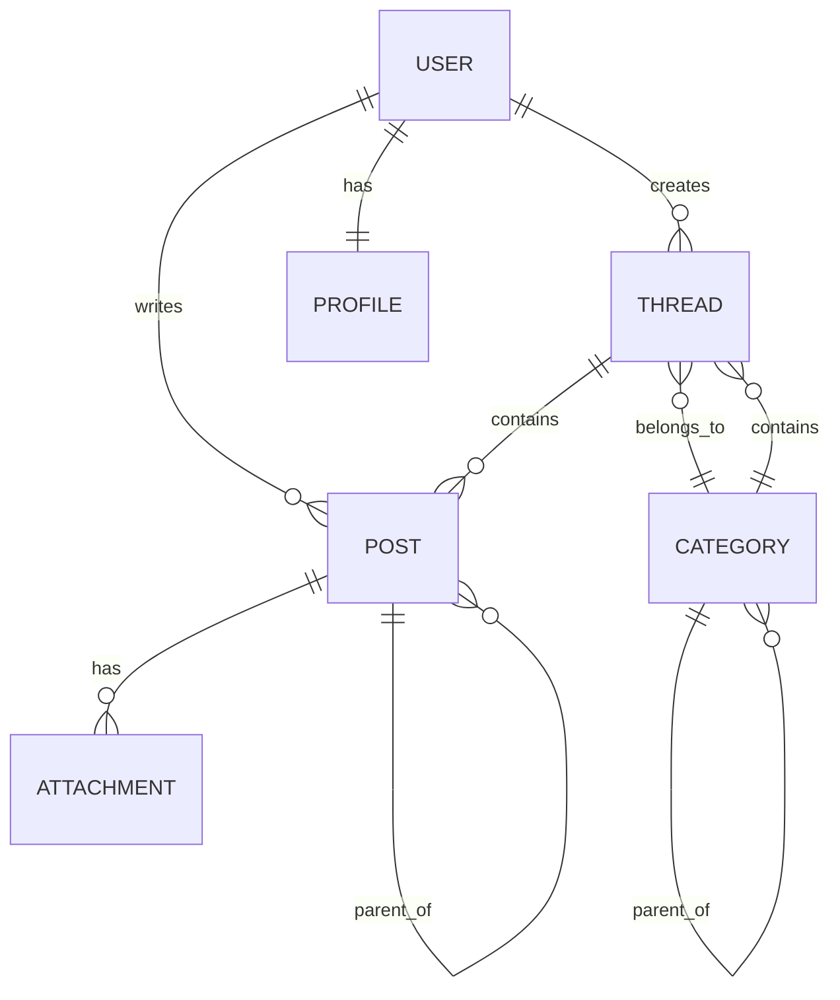

# Domain Model

Let's define the **data structure** for our forum. This is the foundation everything else builds on.

## Core Entities

Our forum has 6 main entities:

```
User ──< Thread ──< Post
 │        │
 │        └──< Category
 │
 └──< Profile
```

### 1. User

Represents someone who uses the forum.

```typescript
interface User {
  id: string                // UUID v7
  username: string          // Unique, used in URLs
  email: string             // For authentication
  displayName: string       // Shown in UI
  avatarUrl: string | null  // Profile picture
  role: 'user' | 'moderator' | 'admin'
  createdAt: string         // ISO 8601 datetime
  lastActiveAt: string      // Last activity timestamp
}
```

**Example:**
```json
{
  "id": "01932c99-c4c9-7c4a-9b3a-8d6f2e4b1a0c",
  "username": "sarah_dev",
  "email": "sarah@example.com",
  "displayName": "Sarah Johnson",
  "avatarUrl": "https://api.dicebear.com/7.x/avataaars/svg?seed=sarah",
  "role": "user",
  "createdAt": "2024-01-15T10:30:00Z",
  "lastActiveAt": "2024-03-20T14:25:00Z"
}
```

### 2. Profile

Extended user information (one-to-one with User).

```typescript
interface Profile {
  userId: string            // UUID v7
  bio: string | null        // Markdown supported
  location: string | null
  website: string | null
  twitterHandle: string | null
  githubUsername: string | null
}
```

**Example:**
```json
{
  "userId": "01932c99-c4c9-7c4a-9b3a-8d6f2e4b1a0c",
  "bio": "Full-stack developer passionate about React and TypeScript",
  "location": "San Francisco, CA",
  "website": "https://sarah.dev",
  "twitterHandle": "sarah_dev",
  "githubUsername": "sarahj"
}
```

### 3. Category

Organize threads into topics (supports nesting).

```typescript
interface Category {
  id: string                // UUID v7
  name: string              // "General Discussion"
  slug: string              // "general-discussion"
  description: string | null
  parentId: string | null   // UUID v7 (for nested categories)
  order: number             // Display order
  createdAt: string
  updatedAt: string
}
```

**Example (top-level):**
```json
{
  "id": "01932c99-d1e2-7f3a-a4b5-1c2d3e4f5a6b",
  "name": "Help & Support",
  "slug": "help-support",
  "description": "Get help with technical issues",
  "parentId": null,
  "order": 1,
  "createdAt": "2024-01-01T00:00:00Z",
  "updatedAt": "2024-01-01T00:00:00Z"
}
```

**Example (nested):**
```json
{
  "id": "01932c99-e2f3-7a4b-b5c6-2d3e4f5a6b7c",
  "name": "React",
  "slug": "react",
  "description": "React-specific questions",
  "parentId": "01932c99-d1e2-7f3a-a4b5-1c2d3e4f5a6b",
  "order": 1,
  "createdAt": "2024-01-01T00:00:00Z",
  "updatedAt": "2024-01-01T00:00:00Z"
}
```

### 4. Thread

A conversation started by a user.

```typescript
interface Thread {
  id: string                // UUID v7
  categoryId: string        // UUID v7
  authorId: string          // UUID v7
  title: string
  slug: string | null       // URL-friendly title
  isPinned: boolean         // Admin can pin important threads
  isLocked: boolean         // Prevent new replies
  viewCount: number         // How many views
  replyCount: number        // Cache for performance
  lastPostId: string | null // UUID v7 (most recent post)
  createdAt: string
  updatedAt: string
  
  // Relations (populated by joins)
  author?: User
  category?: Category
  lastPost?: Post
}
```

**Example:**
```json
{
  "id": "01932c99-f3a4-7b5c-c6d7-3e4f5a6b7c8d",
  "categoryId": "01932c99-e2f3-7a4b-b5c6-2d3e4f5a6b7c",
  "authorId": "01932c99-c4c9-7c4a-9b3a-8d6f2e4b1a0c",
  "title": "How to center a div?",
  "slug": "how-to-center-a-div",
  "isPinned": false,
  "isLocked": false,
  "viewCount": 234,
  "replyCount": 12,
  "lastPostId": "01932c9a-a1b2-7c3d-d4e5-4f5a6b7c8d9e",
  "createdAt": "2024-03-20T10:00:00Z",
  "updatedAt": "2024-03-20T15:30:00Z",
  "author": { /* User object */ },
  "category": { /* Category object */ }
}
```

### 5. Post

A message in a thread (includes the original post and all replies).

```typescript
interface Post {
  id: string                    // UUID v7
  threadId: string              // UUID v7
  parentPostId: string | null   // UUID v7 (for nested replies)
  authorId: string              // UUID v7
  content: string              // Markdown/HTML
  voteScore: number            // Upvotes - downvotes
  isEdited: boolean
  isDeleted: boolean
  createdAt: string
  updatedAt: string
  
  // Relations
  author?: User
  replies?: Post[]             // Nested replies
  attachments?: Attachment[]
}
```

**Example (original post):**
```json
{
  "id": "01932c9a-a1b2-7c3d-d4e5-4f5a6b7c8d9e",
  "threadId": "01932c99-f3a4-7b5c-c6d7-3e4f5a6b7c8d",
  "parentPostId": null,
  "authorId": "01932c99-c4c9-7c4a-9b3a-8d6f2e4b1a0c",
  "content": "I've been trying to center a div for hours...",
  "voteScore": 5,
  "isEdited": false,
  "isDeleted": false,
  "createdAt": "2024-03-20T10:00:00Z",
  "updatedAt": "2024-03-20T10:00:00Z"
}
```

**Example (reply):**
```json
{
  "id": "01932c9a-b2c3-7d4e-e5f6-5a6b7c8d9e0f",
  "threadId": "01932c99-f3a4-7b5c-c6d7-3e4f5a6b7c8d",
  "parentPostId": "01932c9a-a1b2-7c3d-d4e5-4f5a6b7c8d9e",
  "authorId": "01932c99-d2e3-7a4b-a5b6-9c0d1e2f3a4b",
  "content": "Try using flexbox...",
  "voteScore": 15,
  "isEdited": false,
  "isDeleted": false,
  "createdAt": "2024-03-20T11:00:00Z",
  "updatedAt": "2024-03-20T11:00:00Z"
}
```

**Example (nested reply):**
```json
{
  "id": "01932c9a-c3d4-7e5f-f6a7-6b7c8d9e0f1a",
  "threadId": "01932c99-f3a4-7b5c-c6d7-3e4f5a6b7c8d",
  "parentPostId": "01932c9a-b2c3-7d4e-e5f6-5a6b7c8d9e0f",
  "authorId": "01932c99-c4c9-7c4a-9b3a-8d6f2e4b1a0c",
  "content": "OMG it worked! Thank you! 🎉",
  "voteScore": 8,
  "isEdited": false,
  "isDeleted": false,
  "createdAt": "2024-03-20T12:00:00Z",
  "updatedAt": "2024-03-20T12:00:00Z"
}
```

### 6. Attachment

Files attached to posts (images, videos, documents).

```typescript
interface Attachment {
  id: string                // UUID v7
  postId: string            // UUID v7
  filename: string
  url: string
  mimeType: string          // "image/png", "application/pdf"
  size: number              // Bytes
  createdAt: string
}
```

**Example:**
```json
{
  "id": "01932c9a-d4e5-7f6a-a7b8-7c8d9e0f1a2b",
  "postId": "01932c9a-a1b2-7c3d-d4e5-4f5a6b7c8d9e",
  "filename": "screenshot.png",
  "url": "https://cdn.forum.com/attachments/screenshot.png",
  "mimeType": "image/png",
  "size": 245680,
  "createdAt": "2024-03-20T10:00:00Z"
}
```

## Relationships



## TypeScript Type Definitions

Create these in `src/types/index.ts`:

```typescript
// src/types/index.ts

export type UserRole = 'user' | 'moderator' | 'admin'

export interface User {
  id: string
  username: string
  email: string
  displayName: string
  avatarUrl: string | null
  role: UserRole
  createdAt: string
  lastActiveAt: string
}

export interface Profile {
  userId: string
  bio: string | null
  location: string | null
  website: string | null
  twitterHandle: string | null
  githubUsername: string | null
}

export interface Category {
  id: string
  name: string
  slug: string
  description: string | null
  parentId: string | null
  order: number
  createdAt: string
  updatedAt: string
  children?: Category[]
}

export interface Thread {
  id: string
  categoryId: string
  authorId: string
  title: string
  slug: string | null
  isPinned: boolean
  isLocked: boolean
  viewCount: number
  replyCount: number
  lastPostId: string | null
  createdAt: string
  updatedAt: string
  author?: User
  category?: Category
  lastPost?: Post
}

export interface Post {
  id: string
  threadId: string
  parentPostId: string | null
  authorId: string
  content: string
  voteScore: number
  isEdited: boolean
  isDeleted: boolean
  createdAt: string
  updatedAt: string
  author?: User
  replies?: Post[]
  attachments?: Attachment[]
}

```

## API Response Format

All list endpoints return paginated data:

```typescript
interface PaginatedResponse<T> {
  data: T[]
  links: {
    first: string | null
    last: string | null
    prev: string | null
    next: string | null
  }
  meta: {
    current_page: number
    from: number
    last_page: number
    path: string
    per_page: number
    to: number
    total: number
  }
}

// Example usage
type ThreadsResponse = PaginatedResponse<Thread>
```

**Example API response:**
```json
{
  "data": [
    { /* Thread object */ },
    { /* Thread object */ }
  ],
  "links": {
    "first": "/api/threads?page=1",
    "last": "/api/threads?page=10",
    "prev": null,
    "next": "/api/threads?page=2"
  },
  "meta": {
    "current_page": 1,
    "from": 1,
    "last_page": 10,
    "path": "/api/threads",
    "per_page": 20,
    "to": 20,
    "total": 195
  }
}
```

## Mock Data

We'll use mock data initially. Create `src/lib/mockData.ts`:

```typescript
import type { User, Thread, Post, Category } from '@/types'

export const mockUsers: User[] = [
  {
    id: 'usr_1',
    username: 'sarah_dev',
    email: 'sarah@example.com',
    displayName: 'Sarah Johnson',
    avatarUrl: 'https://api.dicebear.com/7.x/avataaars/svg?seed=sarah',
    role: 'user',
    createdAt: '2024-01-15T10:30:00Z',
    lastActiveAt: '2024-03-20T14:25:00Z',
  },
  // More users...
]

export const mockCategories: Category[] = [
  {
    id: 'cat_1',
    name: 'Help & Support',
    slug: 'help-support',
    description: 'Get help with technical issues',
    parentId: null,
    order: 1,
    createdAt: '2024-01-01T00:00:00Z',
    updatedAt: '2024-01-01T00:00:00Z',
  },
  // More categories...
]

export const mockThreads: Thread[] = [
  {
    id: 'thd_1',
    categoryId: 'cat_1',
    authorId: 'usr_1',
    title: 'How to center a div?',
    slug: 'how-to-center-a-div',
    isPinned: false,
    isLocked: false,
    viewCount: 234,
    replyCount: 12,
    lastPostId: 'post_5',
    createdAt: '2024-03-20T10:00:00Z',
    updatedAt: '2024-03-20T15:30:00Z',
  },
  // More threads...
]
```

## Next Steps

Now we understand:
- ✅ What we're building (features)
- ✅ How it looks (UI mockups)
- ✅ How data is structured (domain model)

Time to set up our project and write our first test!

Next: [Create Project →](/en/react/2.setup-and-first-test/create-project)
