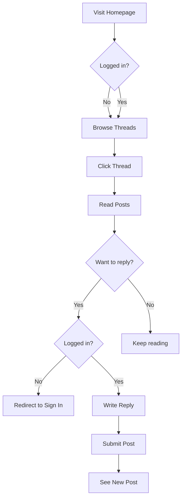

# What We're Building

We'll build a **fully functional forum application** from scratch. This isn't a toy example—it's a real-world app with authentication, CRUD operations, nested comments, voting, and more.

## Why a Forum?

Forums contain nearly every React pattern you'll need:
- **Lists and detail views** (thread list → thread detail)
- **Nested data structures** (replies to replies)
- **Forms with validation** (create thread, sign in)
- **Real-time interactions** (voting, bookmarking)
- **Role-based permissions** (user, moderator, admin)
- **Complex state management** (filters, pagination, auth)

By the end, you'll have built a production-ready app **and** deeply understood React.

## Features We'll Implement

### 🔐 Authentication
- Sign up with email/password
- Sign in with OAuth (Google, Facebook)
- Protected routes for authenticated users
- Role-based access (admin panel)

### 📝 Thread Management
- **Browse threads** with filters (All, My Threads, Bookmarked)
- **Sort** by Recent or Popular
- **Pagination** (20 threads per page)
- **Search** threads by title/content
- **Create thread** with rich text editor
- **Edit/Delete** your own threads
- **Pin threads** (admin only)
- **View count** tracking

### 💬 Posts & Replies
- **Nested replies** (reply to post → reply to reply)
- **Quote** previous posts
- **Vote** on posts (upvote/downvote)
- **Report** inappropriate content
- **Rich text** formatting (bold, italic, links, images)

### 🗂️ Categories
- **Browse categories** (nested structure)
- **Filter threads** by category
- **Admin panel** to manage categories
- **Breadcrumb navigation**

### 👤 User Profiles
- **View profile** (bio, avatar, join date)
- **User activity** (threads created, posts count)
- **Edit profile** settings

### 🎨 UI/UX Features
- **Dark theme** (slate colors, #0f172a background)
- **Responsive design** (mobile, tablet, desktop)
- **Loading states** and skeletons
- **Toast notifications** for actions
- **Infinite scroll** (optional)

## User Flow Example

Let's walk through a typical user journey:



## Tech Stack

We'll use modern, production-proven tools:

| Tool | Purpose | Why |
|------|---------|-----|
| **Vite** | Build tool | Lightning fast, modern defaults |
| **TypeScript** | Type safety | Catch errors early, better DX |
| **React Router v7** | Routing | Data loading, nested routes |
| **Zod** | Validation | Type-safe schemas, runtime validation |
| **React Hook Form** | Forms | Performant, great DX |
| **Tailwind CSS** | Styling | Utility-first, rapid development |
| **Vitest** | Testing | Fast, Jest-compatible |
| **React Testing Library** | Component tests | User-centric testing |

## Learning Approach

This course follows **"Thinking in React"** methodology:

1. **Start with mockups** → Understand what to build
2. **Break UI into components** → Identify the hierarchy
3. **Build static version** → No interactivity yet
4. **Add state** → Make it interactive
5. **Connect to API** → Real data
6. **Add routing** → Multiple pages
7. **Advanced features** → Polish and extend

We'll use **Test-Driven Development (TDD)** from the very beginning:
- Write a failing test
- Make it pass with minimal code
- Refactor
- Repeat

## What You'll Learn

By building this forum, you'll master:

### React Fundamentals
- Components and props
- State and lifecycle
- Events and forms
- Lists and keys
- Conditional rendering

### React Hooks
- `useState` and `useEffect`
- `useContext` for global state
- `useRef` for DOM access
- `useMemo` and `useCallback` for performance
- Custom hooks for reusable logic

### Patterns & Best Practices
- Component composition
- Prop drilling vs Context
- Controlled vs Uncontrolled components
- Error boundaries
- Code splitting and lazy loading

### Testing
- Unit tests for components
- Integration tests for features
- Mocking API calls
- Testing user interactions
- Test coverage and CI/CD

### Real-World Skills
- Form validation and error handling
- Optimistic UI updates
- Pagination and infinite scroll
- Authentication and authorization
- API integration
- Performance optimization
- Deployment strategies

## Project Structure Preview

Here's what our final project will look like:

```
forum-app/
├── src/
│   ├── components/        # Reusable UI components
│   │   ├── layout/       # Navbar, Footer, Container
│   │   ├── forum/        # ThreadCard, PostCard, Reply
│   │   └── ui/           # Button, Input, Badge
│   ├── features/          # Feature-based modules
│   │   ├── auth/         # Sign in, Sign up
│   │   ├── threads/      # Thread list, detail, create
│   │   ├── posts/        # Post, reply, vote
│   │   └── admin/        # Category management
│   ├── hooks/             # Custom hooks
│   │   ├── useAuth.ts
│   │   ├── useFetch.ts
│   │   └── usePagination.ts
│   ├── lib/               # Utilities
│   │   ├── api.ts        # HTTP client
│   │   ├── schemas.ts    # Zod schemas
│   │   └── utils.ts      # Helper functions
│   ├── types/             # TypeScript types
│   │   └── index.ts
│   └── App.tsx            # Root component
├── tests/                 # Test files
└── public/                # Static assets
```

## Getting Started

In the next section, we'll:
1. Look at the UI mockups in detail
2. Define the domain model (data structure)
3. Set up our development environment
4. Write our first test

Ready? Let's dive in! 🚀

Next: [UI Mockups & Design →](/en/react/1.what-we-are-building/ui-mockups)

::alert{type="success"}
**Pro tip:** Keep the mockups and domain model handy. We'll reference them constantly as we build.
::
