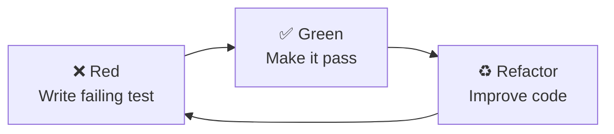

# Disclaimer

:::u-alert
---
title: Comments in the code are for educational purposes only.
description: In real projects, avoid adding irrelevant or redundant comments.
color: warning
variant: subtle
icon: i-lucide-triangle-alert
---
:::

We'll use **Vitest** for fast unit tests and **React Testing Library** for testing components the way users interact with them.

## Why Test-Driven Development?

TDD gives us:
- **Confidence**: Know your code works before shipping
- **Better design**: Tests force you to think about APIs first
- **Documentation**: Tests show how code should be used
- **Refactoring safety**: Change code without breaking features

## Install Testing Dependencies

Already installed in previous step, but here's what we added:

```bash
npm install -D vitest @testing-library/react @testing-library/jest-dom @testing-library/user-event jsdom
```

**What each does:**
- `vitest` - Test runner (like Jest, but faster)
- `@testing-library/react` - Test React components
- `@testing-library/jest-dom` - Custom matchers (`.toBeInTheDocument()`)
- `@testing-library/user-event` - Simulate user interactions
- `jsdom` - Simulate browser environment

## Configure Vitest

Create `vitest.config.ts`:

```typescript
import { defineConfig } from 'vitest/config'
import react from '@vitejs/plugin-react'
import path from 'path'

export default defineConfig({
  plugins: [react()],
  test: {
    globals: true,
    environment: 'jsdom',
    setupFiles: './src/__tests__/setup.ts',
    css: true,
  },
  resolve: {
    alias: {
      '@': path.resolve(__dirname, './src'),
    },
  },
})
```

## Create Test Setup File

Create `src/__tests__/setup.ts`:

```typescript
import { expect, afterEach } from 'vitest'
import { cleanup } from '@testing-library/react'
import * as matchers from '@testing-library/jest-dom/matchers'

// Extend Vitest's expect with jest-dom matchers
expect.extend(matchers)

// Cleanup after each test
afterEach(() => {
  cleanup()
})
```

## Add Test Scripts

Update `package.json`:

```json
{
  "scripts": {
    "dev": "vite",
    "build": "tsc && vite build",
    "preview": "vite preview",
    "test": "vitest",
    "test:ui": "vitest --ui",
    "test:coverage": "vitest --coverage"
  }
}
```

**Available commands:**
- `npm test` - Run tests in watch mode
- `npm run test:ui` - Open Vitest UI
- `npm run test:coverage` - Generate coverage report

## Create Test Utilities

Create `src/__tests__/utils.tsx` for reusable test helpers:

```typescript
import { render, RenderOptions } from '@testing-library/react'
import { ReactElement } from 'react'
import { BrowserRouter } from 'react-router-dom'

// Custom render that includes common providers
export function renderWithRouter(
  ui: ReactElement,
  options?: Omit<RenderOptions, 'wrapper'>
) {
  return render(ui, {
    wrapper: ({ children }) => (
      <BrowserRouter>
        {children}
      </BrowserRouter>
    ),
    ...options,
  })
}

// Re-export everything from React Testing Library
export * from '@testing-library/react'
export { renderWithRouter as render }
```

## Verify Setup

Create a simple test to verify everything works:

```typescript
// src/__tests__/setup.test.ts
import { describe, it, expect } from 'vitest'

describe('Test Setup', () => {
  it('should run tests', () => {
    expect(true).toBe(true)
  })

  it('should support jest-dom matchers', () => {
    const element = document.createElement('div')
    element.textContent = 'Hello'
    expect(element).toHaveTextContent('Hello')
  })
})
```

Run the test:

```bash
npm test
```

You should see:
```
✓ src/__tests__/setup.test.ts (2)
  ✓ Test Setup (2)
    ✓ should run tests
    ✓ should support jest-dom matchers

Test Files  1 passed (1)
     Tests  2 passed (2)
```

## TDD Workflow

We'll follow the **Red-Green-Refactor** cycle:



### Example Workflow

1. **Red** - Write a test that fails:
```typescript
it('should render username', () => {
  render(<UserBadge username="sarah_dev" />)
  expect(screen.getByText('sarah_dev')).toBeInTheDocument()
})
```

2. **Green** - Write minimal code to pass:
```tsx
function UserBadge({ username }: { username: string }) {
  return <span>{username}</span>
}
```

3. **Refactor** - Improve without breaking tests:
```tsx
function UserBadge({ username }: { username: string }) {
  return (
    <span className="font-medium text-forum-primary">
      @{username}
    </span>
  )
}
```

## Testing Best Practices

### ✅ Do

- Test behavior, not implementation
- Use accessible queries (`getByRole`, `getByLabelText`)
- Test user interactions
- Keep tests simple and readable
- Mock external dependencies (API calls)

### ❌ Don't

- Test implementation details (state, props)
- Use `data-testid` unless necessary
- Test third-party libraries
- Write brittle tests tied to CSS classes
- Skip edge cases

## Example Test

Here's what a good test looks like:

```typescript
import { describe, it, expect } from 'vitest'
import { render, screen } from '@/__tests__/utils'
import userEvent from '@testing-library/user-event'
import { Button } from '@/components/ui/Button'

describe('Button', () => {
  it('renders button text', () => {
    render(<Button>Click me</Button>)
    expect(screen.getByRole('button', { name: /click me/i })).toBeInTheDocument()
  })

  it('calls onClick when clicked', async () => {
    const handleClick = vi.fn()
    const user = userEvent.setup()

    render(<Button onClick={handleClick}>Click me</Button>)
    await user.click(screen.getByRole('button'))

    expect(handleClick).toHaveBeenCalledOnce()
  })

  it('is disabled when disabled prop is true', () => {
    render(<Button disabled>Click me</Button>)
    expect(screen.getByRole('button')).toBeDisabled()
  })
})
```

## Common Testing Patterns

### Testing Forms

```typescript
it('submits form with valid data', async () => {
  const handleSubmit = vi.fn()
  const user = userEvent.setup()

  render(<SignInForm onSubmit={handleSubmit} />)

  await user.type(screen.getByLabelText(/email/i), 'user@example.com')
  await user.type(screen.getByLabelText(/password/i), 'password123')
  await user.click(screen.getByRole('button', { name: /sign in/i }))

  expect(handleSubmit).toHaveBeenCalledWith({
    email: 'user@example.com',
    password: 'password123',
  })
})
```

### Testing Async

```typescript
it('loads and displays threads', async () => {
  render(<ThreadList />)

  // Initially shows loading
  expect(screen.getByText(/loading/i)).toBeInTheDocument()

  // Wait for threads to load
  const firstThread = await screen.findByText('How to center a div?')
  expect(firstThread).toBeInTheDocument()
})
```

### Mocking API Calls

```typescript
import { vi } from 'vitest'

vi.mock('@/lib/api', () => ({
  apiClient: {
    get: vi.fn(() => Promise.resolve({ data: [] })),
    post: vi.fn(() => Promise.resolve({ data: {} })),
  },
}))
```

## Next Steps

Testing is configured! Now let's write our **first component using TDD**.

Next: [First Component Test →](/en/react/2.setup-and-first-test/first-component-test)
