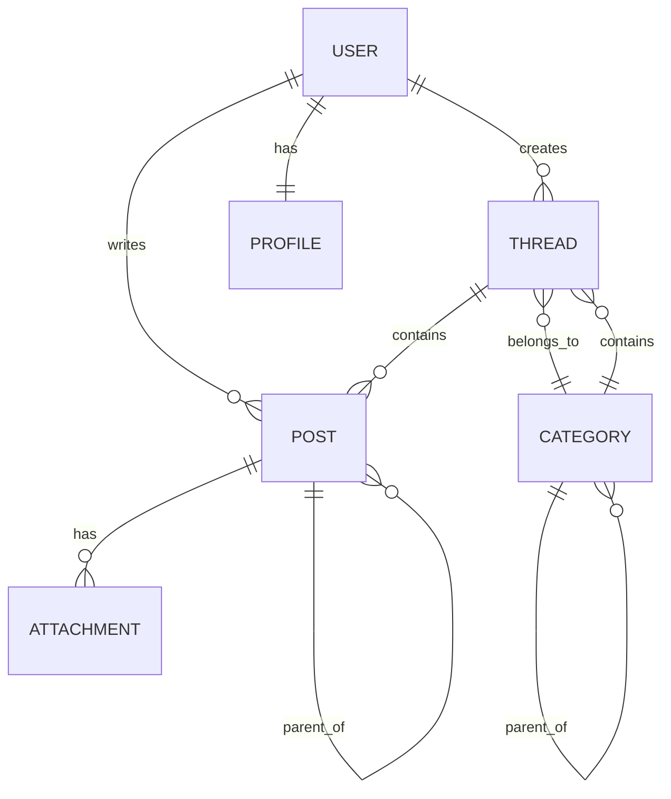

# Domain Model

Vamos a definir la **estructura de datos** de nuestro foro. Sobre este modelo se construyen todas las pantallas, formularios y reglas de negocio.

## Core Entities

Nuestro foro tiene 6 entidades principales:

```text
User ──< Thread ──< Post
 │        │
 │        └──< Category
 │
 └──< Profile
```

### 1. User

Representa a una persona que usa el foro.

```ts
interface User {
  id: string                // UUID v7
  username: string          // Único, usado en URLs
  email: string             // Para authentication
  displayName: string       // Nombre mostrado en la UI
  avatarUrl: string | null  // Foto de perfil
  role: 'user' | 'moderator' | 'admin'
  createdAt: string         // ISO 8601 datetime
  lastActiveAt: string      // Última actividad
}
```

**Ejemplo:**

```json
{
  "id": "01932c99-c4c9-7c4a-9b3a-8d6f2e4b1a0c",
  "username": "sarah_dev",
  "email": "sarah@example.com",
  "displayName": "Sarah Johnson",
  "avatarUrl": "https://api.dicebear.com/7.x/avataaars/svg?seed=sarah",
  "role": "user",
  "createdAt": "2024-01-15T10:30:00Z",
  "lastActiveAt": "2024-03-20T14:25:00Z"
}
```

### 2. Profile

Información extendida del usuario (relación uno a uno con `User`).

```ts
interface Profile {
  userId: string            // UUID v7
  bio: string | null        // Soporta Markdown
  location: string | null
  website: string | null
  twitterHandle: string | null
  githubUsername: string | null
}
```

**Ejemplo:**

```json
{
  "userId": "01932c99-c4c9-7c4a-9b3a-8d6f2e4b1a0c",
  "bio": "Full-stack developer passionate about React and TypeScript",
  "location": "San Francisco, CA",
  "website": "https://sarah.dev",
  "twitterHandle": "sarah_dev",
  "githubUsername": "sarahj"
}
```

### 3. Category

Organiza los threads por tema (con soporte para anidación).

```ts
interface Category {
  id: string                // UUID v7
  name: string              // "General Discussion"
  slug: string              // "general-discussion"
  description: string | null
  parentId: string | null   // Para nested categories
  order: number             // Orden de visualización
  createdAt: string
  updatedAt: string
}
```

**Ejemplo (nivel superior):**

```json
{
  "id": "01932c99-d1e2-7f3a-a4b5-1c2d3e4f5a6b",
  "name": "Help & Support",
  "slug": "help-support",
  "description": "Get help with technical issues",
  "parentId": null,
  "order": 1,
  "createdAt": "2024-01-01T00:00:00Z",
  "updatedAt": "2024-01-01T00:00:00Z"
}
```

**Ejemplo (anidada):**

```json
{
  "id": "01932c99-e2f3-7a4b-b5c6-2d3e4f5a6b7c",
  "name": "React",
  "slug": "react",
  "description": "React-specific questions",
  "parentId": "01932c99-d1e2-7f3a-a4b5-1c2d3e4f5a6b",
  "order": 1,
  "createdAt": "2024-01-01T00:00:00Z",
  "updatedAt": "2024-01-01T00:00:00Z"
}
```

### 4. Thread

Una conversación iniciada por un usuario.

```ts
interface Thread {
  id: string                // UUID v7
  categoryId: string        // UUID v7
  authorId: string          // UUID v7
  title: string
  slug: string | null       // URL-friendly title
  isPinned: boolean         // Admin puede fijar hilos importantes
  isLocked: boolean         // Bloquea nuevas respuestas
  viewCount: number         // Número de vistas
  replyCount: number        // Cache para performance
  lastPostId: string | null // Último post del hilo
  createdAt: string
  updatedAt: string
  
  // Relaciones (join de la API)
  author?: User
  category?: Category
  lastPost?: Post
}
```

### 5. Post

Mensaje dentro de un thread (incluye el post original y todas las replies).

```ts
interface Post {
  id: string                    // UUID v7
  threadId: string              // UUID v7
  parentPostId: string | null   // Para nested replies
  authorId: string              // UUID v7
  content: string              // Markdown/HTML
  voteScore: number            // Upvotes - downvotes
  isEdited: boolean
  isDeleted: boolean
  createdAt: string
  updatedAt: string
  
  // Relaciones
  author?: User
  replies?: Post[]             // Respuestas anidadas
  attachments?: Attachment[]
}
```

### 6. Attachment

Archivos adjuntos a posts (imágenes, vídeos, documentos).

```ts
interface Attachment {
  id: string                // UUID v7
  postId: string            // UUID v7
  filename: string
  url: string
  mimeType: string          // "image/png", "application/pdf"
  size: number              // Bytes
  createdAt: string
}
```

## Relationships



## TypeScript Type Definitions

Crea estos tipos en `src/types/index.ts`:

```ts
// src/types/index.ts

export type UserRole = 'user' | 'moderator' | 'admin'

export interface User {
  id: string
  username: string
  email: string
  displayName: string
  avatarUrl: string | null
  role: UserRole
  createdAt: string
  lastActiveAt: string
}

export interface Profile {
  userId: string
  bio: string | null
  location: string | null
  website: string | null
  twitterHandle: string | null
  githubUsername: string | null
}

export interface Category {
  id: string
  name: string
  slug: string
  description: string | null
  parentId: string | null
  order: number
  createdAt: string
  updatedAt: string
  children?: Category[]
}

export interface Thread {
  id: string
  categoryId: string
  authorId: string
  title: string
  slug: string | null
  isPinned: boolean
  isLocked: boolean
  viewCount: number
  replyCount: number
  lastPostId: string | null
  createdAt: string
  updatedAt: string
  author?: User
  category?: Category
  lastPost?: Post
}

export interface Post {
  id: string
  threadId: string
  parentPostId: string | null
  authorId: string
  content: string
  voteScore: number
  isEdited: boolean
  isDeleted: boolean
  createdAt: string
  updatedAt: string
  author?: User
  replies?: Post[]
  attachments?: Attachment[]
}

export interface Attachment {
  id: string
  postId: string
  filename: string
  url: string
  mimeType: string
  size: number
  createdAt: string
}

export interface PaginatedResponse<T> {
  data: T[]
  links: {
    first: string | null
    last: string | null
    prev: string | null
    next: string | null
  }
  meta: {
    current_page: number
    from: number
    last_page: number
    path: string
    per_page: number
    to: number
    total: number
  }
}

// Ejemplo de uso
type ThreadsResponse = PaginatedResponse<Thread>
```

## API Response Format

Todos los endpoints de listas devuelven datos paginados:

```json
{
  "data": [
    { /* Thread object */ },
    { /* Thread object */ }
  ],
  "links": {
    "first": "/api/threads?page=1",
    "last": "/api/threads?page=10",
    "prev": null,
    "next": "/api/threads?page=2"
  },
  "meta": {
    "current_page": 1,
    "from": 1,
    "last_page": 10,
    "path": "/api/threads",
    "per_page": 20,
    "to": 20,
    "total": 195
  }
}
```

## Mock Data

Inicialmente usaremos mock data. Crea `src/lib/mockData.ts`:

```ts
import type { User, Thread, Post, Category } from '@/types'

export const mockUsers: User[] = [
  {
    id: 'usr_1',
    username: 'sarah_dev',
    email: 'sarah@example.com',
    displayName: 'Sarah Johnson',
    avatarUrl: 'https://api.dicebear.com/7.x/avataaars/svg?seed=sarah',
    role: 'user',
    createdAt: '2024-01-15T10:30:00Z',
    lastActiveAt: '2024-03-20T14:25:00Z',
  },
  // More users...
]

export const mockCategories: Category[] = [
  {
    id: 'cat_1',
    name: 'Help & Support',
    slug: 'help-support',
    description: 'Get help with technical issues',
    parentId: null,
    order: 1,
    createdAt: '2024-01-01T00:00:00Z',
    updatedAt: '2024-01-01T00:00:00Z',
  },
  // More categories...
]

export const mockThreads: Thread[] = [
  {
    id: 'thd_1',
    categoryId: 'cat_1',
    authorId: 'usr_1',
    title: 'How to center a div?',
    slug: 'how-to-center-a-div',
    isPinned: false,
    isLocked: false,
    viewCount: 234,
    replyCount: 12,
    lastPostId: 'post_5',
    createdAt: '2024-03-20T10:00:00Z',
    updatedAt: '2024-03-20T15:30:00Z',
  },
  // More threads...
]
```

## Next Steps

Ya entendemos:

- ✅ Qué estamos construyendo (features).
- ✅ Cómo se ve (UI mockups).
- ✅ Cómo se estructura el dato (domain model).

Ahora toca configurar el proyecto y escribir nuestro primer test.

Next: [Create Project →](/es/react/2.setup/create-project)
