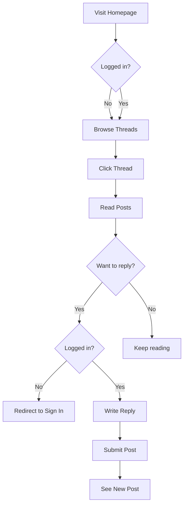

# Qué vamos a construir

Vamos a construir una **aplicación de foro completamente funcional** desde cero. No es un ejemplo de juguete: es una app real con authentication, operaciones CRUD, nested comments, voting y mucho más.

## ¿Por qué un foro?

Un foro contiene casi todos los patrones de React que necesitas en proyectos reales:

- **Lists y detail views** (thread list → thread detail).
- **Estructuras de datos anidadas** (replies de replies).
- **Forms con validación** (create thread, sign in).
- **Interacciones en tiempo real** (voting, bookmarking).
- **Role-based permissions** (user, moderator, admin).
- **Gestión de estado compleja** (filters, pagination, auth).

Al final, habrás construido una app lista para producción **y** entendido React en profundidad.

## Funcionalidades que implementaremos

### 🔐 Authentication

- Sign up con email/password.
- Sign in con OAuth (Google, Facebook).
- Protected routes para usuarios autenticados.
- Role-based access (admin panel).

### 📝 Thread Management

- **Browse threads** con filtros (All, My Threads, Bookmarked).
- **Sort** por Recent o Popular.
- **Pagination** (20 threads por página).
- **Search** de threads por title/content.
- **Create thread** con rich text editor.
- **Edit/Delete** de tus propios threads.
- **Pin threads** (solo admin).
- Seguimiento de **view count**.

### 💬 Posts & Replies

- **Nested replies** (reply a post → reply a reply).
- Posibilidad de **quote** de posts anteriores.
- **Vote** en posts (upvote/downvote).
- **Report** de contenido inapropiado.
- **Rich text** formatting (bold, italic, links, images).

### 🗂️ Categories

- **Browse categories** (estructura anidada).
- **Filter threads** por category.
- **Admin panel** para gestionar categories.
- **Breadcrumb navigation**.

### 👤 User Profiles

- **View profile** (bio, avatar, join date).
- **User activity** (threads creados, posts count).
- **Edit profile** settings.

### 🎨 UI/UX Features

- **Dark theme** (colores slate, fondo #0f172a).
- **Responsive design** (mobile, tablet, desktop).
- **Loading states** y skeletons.
- **Toast notifications** para acciones.
- **Infinite scroll** (opcional).

## User Flow de ejemplo



## Tech Stack

Usaremos herramientas modernas, probadas en producción:

| Tool | Purpose | Why |
|------|---------|-----|
| **Vite** | Build tool | Lightning fast, modern defaults |
| **TypeScript** | Type safety | Catch errors early, better DX |
| **React Router v7** | Routing | Data loading, nested routes |
| **Zod** | Validation | Type-safe schemas, runtime validation |
| **React Hook Form** | Forms | Performant, great DX |
| **Tailwind CSS** | Styling | Utility-first, rapid development |
| **Vitest** | Testing | Fast, Jest-compatible |
| **React Testing Library** | Component tests | User-centric testing |

## Enfoque de aprendizaje

Esta guía sigue la metodología de **"Thinking in React"**:

1. **Start with mockups** → entender qué vamos a construir.
2. **Break UI into components** → identificar la jerarquía.
3. **Build static version** → sin interactividad todavía.
4. **Add state** → hacer la UI interactiva.
5. **Connect to API** → datos reales.
6. **Add routing** → múltiples páginas.
7. **Advanced features** → pulir y extender.

Usaremos **Test-Driven Development (TDD)** desde el principio:

- Escribir un test que falle.
- Hacer que pase con el mínimo código.
- Refactorizar.
- Repetir.

## Qué aprenderás

Construyendo este foro, dominarás:

### React Fundamentals

- Components y props.
- State y lifecycle.
- Events y forms.
- Lists y keys.
- Conditional rendering.

### React Hooks

- `useState` y `useEffect`.
- `useContext` para estado global.
- `useRef` para acceso al DOM.
- `useMemo` y `useCallback` para performance.
- Custom hooks para lógica reutilizable.

### Patterns & Best Practices

- Component composition.
- Prop drilling vs Context.
- Controlled vs Uncontrolled components.
- Error boundaries.
- Code splitting y lazy loading.

### Testing

- Unit tests para componentes.
- Integration tests para features.
- Mocking de API calls.
- Testing de interacciones de usuario.
- Test coverage y CI/CD.

### Habilidades reales

- Form validation y error handling.
- Optimistic UI updates.
- Pagination e infinite scroll.
- Authentication y authorization.
- API integration.
- Performance optimization.
- Deployment strategies.

## Vista previa de la estructura del proyecto

```text
forum-app/
├── src/
│   ├── components/        # Reusable UI components
│   │   ├── layout/       # Navbar, Footer, Container
│   │   ├── forum/        # ThreadCard, PostCard, Reply
│   │   └── ui/           # Button, Input, Badge
│   ├── features/          # Feature-based modules
│   │   ├── auth/         # Sign in, Sign up
│   │   ├── threads/      # Thread list, detail, create
│   │   ├── posts/        # Post, reply, vote
│   │   └── admin/        # Category management
│   ├── hooks/             # Custom hooks
│   │   ├── useAuth.ts
│   │   ├── useFetch.ts
│   │   └── usePagination.ts
│   ├── lib/               # Utilities
│   │   ├── api.ts        # HTTP client
│   │   ├── schemas.ts    # Zod schemas
│   │   └── utils.ts      # Helper functions
│   ├── types/             # TypeScript types
│   │   └── index.ts
│   └── App.tsx            # Root component
├── tests/                 # Test files
└── public/                # Static assets
```

## Getting Started

En la siguiente sección vamos a:

1. Analizar en detalle los UI mockups.
2. Definir el domain model (estructura de datos).
3. Configurar el entorno de desarrollo.
4. Escribir nuestro primer test.

Ready? Let's dive in! 🚀

Next: [UI Mockups & Design →](/es/react/1.introduction/ui-mockups)
