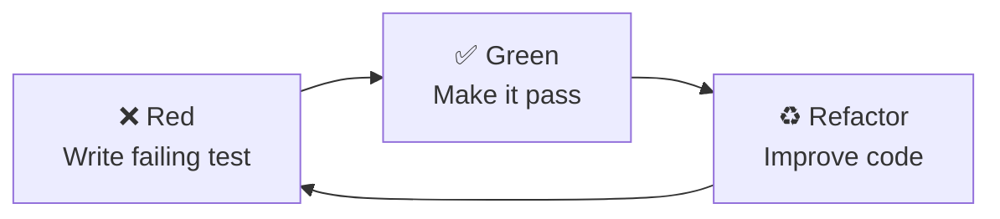

# Disclaimer

:::u-alert
---
title: Los comentarios en el código son solo educativos.
description: En proyectos reales, evita comentarios irrelevantes o redundantes.
color: warning
variant: subtle
icon: i-lucide-triangle-alert
---
:::

Usaremos **Vitest** para unit tests rápidos y **React Testing Library** para testear componentes como interactúan los usuarios.

## ¿Por qué Test-Driven Development?

TDD nos da:
- **Confianza**: Sabes que tu código funciona antes de desplegar.
- **Mejor diseño**: Los tests te obligan a pensar en las APIs primero.
- **Documentación**: Los tests muestran cómo se debe usar el código.
- **Seguridad al refactorizar**: Cambia código sin romper funcionalidades.

## Instalar dependencias de testing

Ya se instalaron en el paso anterior, pero esto es lo que añadimos:

```bash
npm install -D vitest @testing-library/react @testing-library/jest-dom @testing-library/user-event jsdom
```

**Qué hace cada uno:**
- `vitest` – Test runner (como Jest, pero más rápido).
- `@testing-library/react` – Para testear componentes React.
- `@testing-library/jest-dom` – Matchers personalizados (`.toBeInTheDocument()`).
- `@testing-library/user-event` – Simula interacciones de usuario.
- `jsdom` – Simula un entorno de navegador.

## Configurar Vitest

Crea `vitest.config.ts`:

```typescript
import { defineConfig } from 'vitest/config'
import react from '@vitejs/plugin-react'
import path from 'path'

export default defineConfig({
  plugins: [react()],
  test: {
    globals: true,
    environment: 'jsdom',
    setupFiles: './src/__tests__/setup.ts',
    css: true,
  },
  resolve: {
    alias: {
      '@': path.resolve(__dirname, './src'),
    },
  },
})
```

## Crear archivo de configuración de tests

Crea `src/__tests__/setup.ts`:

```typescript
import { expect, afterEach } from 'vitest'
import { cleanup } from '@testing-library/react'
import * as matchers from '@testing-library/jest-dom/matchers'

// Extender expect de Vitest con los matchers de jest-dom
expect.extend(matchers)

// Cleanup después de cada test
afterEach(() => {
  cleanup()
})
```

## Añadir scripts de testing

Actualiza `package.json`:

```json
{
  "scripts": {
    "dev": "vite",
    "build": "tsc && vite build",
    "preview": "vite preview",
    "test": "vitest",
    "test:ui": "vitest --ui",
    "test:coverage": "vitest --coverage"
  }
}
```

**Comandos disponibles:**
- `npm test` – Ejecuta tests en modo watch.
- `npm run test:ui` – Abre la UI de Vitest.
- `npm run test:coverage` – Genera un reporte de cobertura.

## Crear utilidades de testing

Crea `src/__tests__/utils.tsx` con helpers reutilizables:

```typescript
import { render, RenderOptions } from '@testing-library/react'
import { ReactElement } from 'react'
import { BrowserRouter } from 'react-router-dom'

// Render personalizado que incluye providers comunes
export function renderWithRouter(
  ui: ReactElement,
  options?: Omit<RenderOptions, 'wrapper'>
) {
  return render(ui, {
    wrapper: ({ children }) => (
      <BrowserRouter>
        {children}
      </BrowserRouter>
    ),
    ...options,
  })
}

// Re-exportar todo de React Testing Library
export * from '@testing-library/react'
export { renderWithRouter as render }
```

## Verificar configuración

Crea un test simple para verificar que todo funciona:

```typescript
// src/__tests__/setup.test.ts
import { describe, it, expect } from 'vitest'

describe('Test Setup', () => {
  it('should run tests', () => {
    expect(true).toBe(true)
  })

  it('should support jest-dom matchers', () => {
    const element = document.createElement('div')
    element.textContent = 'Hello'
    expect(element).toHaveTextContent('Hello')
  })
})
```

Ejecuta el test:

```bash
npm test
```

Deberías ver:
```text
✓ src/__tests__/setup.test.ts (2)
  ✓ Test Setup (2)
    ✓ should run tests
    ✓ should support jest-dom matchers

Test Files  1 passed (1)
     Tests  2 passed (2)
```

## Flujo TDD

Seguiremos el ciclo **Red-Green-Refactor**:



### Ejemplo de flujo

1. **Red** – Escribe un test que falla:
```typescript
it('should render username', () => {
  render(<UserBadge username="sarah_dev" />)
  expect(screen.getByText('sarah_dev')).toBeInTheDocument()
})
```

2. **Green** – Escribe el mínimo código para que pase:
```tsx
function UserBadge({ username }: { username: string }) {
  return <span>{username}</span>
}
```

3. **Refactor** – Mejora sin romper los tests:
```tsx
function UserBadge({ username }: { username: string }) {
  return (
    <span className="font-medium text-forum-primary">
      @{username}
    </span>
  )
}
```

## Buenas prácticas de testing

### ✅ Haz

- Testea comportamiento, no implementación.
- Usa queries accesibles (`getByRole`, `getByLabelText`).
- Testea interacciones de usuario.
- Mantén los tests simples y legibles.
- Mockea dependencias externas (API calls).

### ❌ No hagas

- Testees detalles internos (estado, props).
- Uses `data-testid` a menos que sea necesario.
- Testees librerías de terceros.
- Escribas tests frágiles ligados a clases CSS.
- Saltes casos edge.

## Ejemplo de test

Así se ve un buen test:

```typescript
import { describe, it, expect } from 'vitest'
import { render, screen } from '@/__tests__/utils'
import userEvent from '@testing-library/user-event'
import { Button } from '@/components/ui/Button'

describe('Button', () => {
  it('renders button text', () => {
    render(<Button>Click me</Button>)
    expect(screen.getByRole('button', { name: /click me/i })).toBeInTheDocument()
  })

  it('calls onClick when clicked', async () => {
    const handleClick = vi.fn()
    const user = userEvent.setup()

    render(<Button onClick={handleClick}>Click me</Button>)
    await user.click(screen.getByRole('button'))

    expect(handleClick).toHaveBeenCalledOnce()
  })

  it('is disabled when disabled prop is true', () => {
    render(<Button disabled>Click me</Button>)
    expect(screen.getByRole('button')).toBeDisabled()
  })
})
```

## Patrones comunes de testing

### Testear forms

```typescript
it('submits form with valid data', async () => {
  const handleSubmit = vi.fn()
  const user = userEvent.setup()

  render(<SignInForm onSubmit={handleSubmit} />)

  await user.type(screen.getByLabelText(/email/i), 'user@example.com')
  await user.type(screen.getByLabelText(/password/i), 'password123')
  await user.click(screen.getByRole('button', { name: /sign in/i }))

  expect(handleSubmit).toHaveBeenCalledWith({
    email: 'user@example.com',
    password: 'password123',
  })
})
```

### Testear async

```typescript
it('loads and displays threads', async () => {
  render(<ThreadList />)

  // Initially shows loading
  expect(screen.getByText(/loading/i)).toBeInTheDocument()

  // Wait for threads to load
  const firstThread = await screen.findByText('How to center a div?')
  expect(firstThread).toBeInTheDocument()
})
```

### Mockear API calls

```typescript
import { vi } from 'vitest'

vi.mock('@/lib/api', () => ({
  apiClient: {
    get: vi.fn(() => Promise.resolve({ data: [] })),
    post: vi.fn(() => Promise.resolve({ data: {} })),
  },
}))
```

## Next Steps

¡Testing configurado! Ahora vamos a escribir nuestro **primer componente usando TDD**.

Next: [First Component Test →](/es/react/2.setup/first-component-test)
